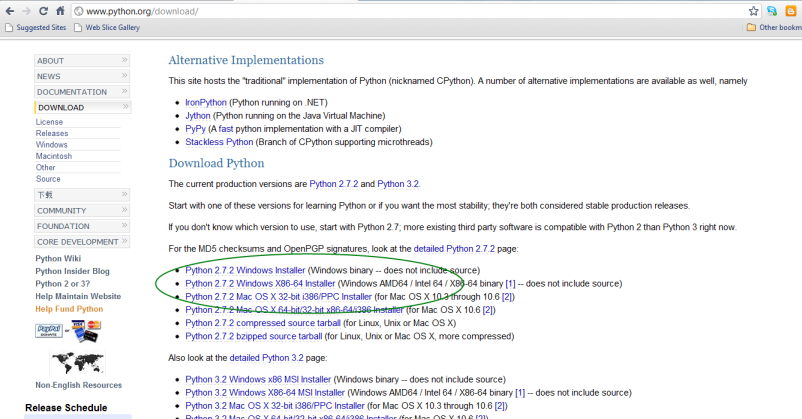
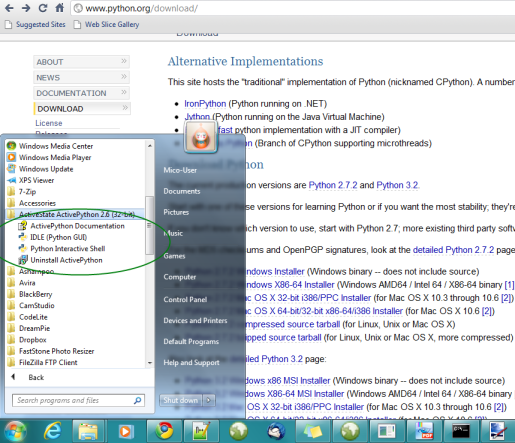
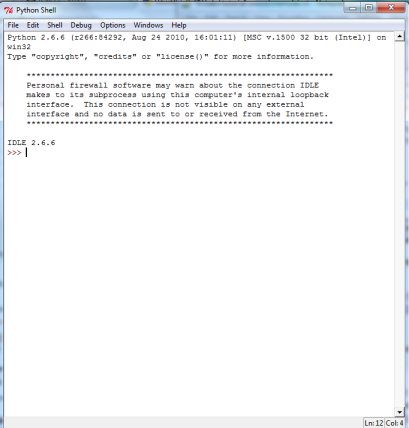
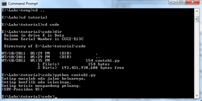

Instalasi dan Memulai Python
=============================

Instalasi Python
-----------------

Tentu saja sebelum mempelajari pemrograman Python di Windows, Anda perlu melakukan instalasi Python.

Pertama-tama, *download* installer Python 2 dari `situs official Python`_.

.. _situs official Python: http://www.python.org/download/

Saat saya menulis tutorial ini versi yang terakhir adalah versi 2.7.2. Saya pilih versi 2.7.2 Windows Installer. Klik saja link `Python 2.7.2 Windows Installer`_.

.. _Python 2.7.2 Windows Installer: http://www.python.org/ftp/python/2.7.2/python-2.7.2.msi

Setelah proses *download* selesai. Klik *2x* file installer, maka proses instalasi Python dimulai. Proses Instalasi Python sama saja dengan proses instalasi aplikasi Windows lainnya.

Memulai Python
---------------

Setelah proses instalasi selesai, maka Python dapat dijalankan sama juga seperti aplikasi Windows lainnya. Di Windows 7 saya:

jalankan IDLE (Python GUI). Maka jendela IDLE akan muncul.

dan kita siap untuk membuat program pertama kita. Di jendela IDLE buat jendela baru dengan meng-klik *File >> New Window* atau dengan menekan kombinasi *Ctrl+N* pada *keyboard*. Di jendela yang baru muncul tersebut baris-baris berikut::
    
	print "Setiap masalah ada jalan keluarnya,"
	print "Setiap konflik ada solusinya,"
	print "Setiap krisis mengandung peluang."
	print "(SBY-Presiden RI)"
	
kemudian simpan script di atas dengan meng-klik *File >> Save* atau dengan menekan kombinasi *Ctrl+S* maka akan muncul jendela untuk menyimpan file. Beri nama file *contoh1.py*. 

Selamat! Anda telah membuat program Python pertama Anda! Untuk menjalankan program, buka jendela *command prompt* dan pindah ke direktori tempat *contoh1.py* berada. Di *command prompt* ketikkan *python contoh1.py* maka seharusnya yang akan Anda lihat seperti berikut::

    Setiap masalah ada jalan keluarnya,
    Setiap konflik ada solusinya,
    Setiap krisis mengandung peluang.
    (SBY-Presiden RI)

Rangkuman
----------

Pada bagian ini kita telah mempelajari tentang:

* instalasi python
* membuat *script* program python dalam IDLE
* menyimpan dan menjalankan *script* python

Selamat! Kini Anda boleh mengatakan kepada keluarga dan teman-teman Anda bahwa Anda adalah seoarang *Python Programmer*

